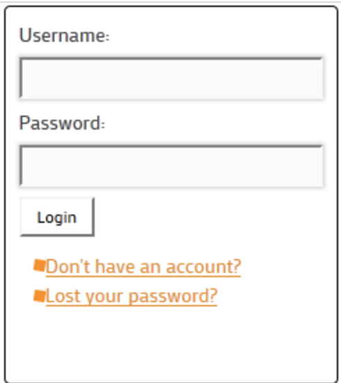

Have your browsed through the internet lately and then *view-source(d)* on some
pages? Have you noticed that almost all CSS classes resemble this pattern:
`some-thing__other-thing---change-looks` --- mind the double underscores and
double dashes... Wondering what's that?

That my friend, happens to be a newish CSS naming methodology / notation created
by the good people at [Yandex](https://www.yandex.ru/) called [BEM - Block Element Modifier](https://en.bem.info/).

The core idea is that web pages are composed by blocks, which in turn contain
elements which in their turn can vary depending on some condition. (Blocks can
contain blocks within them BTW).
So, what is done is when assigning classes names to page elements, name them in
the form of `block__element---modifier` depending on what an element is on the
page.

The convention promises to address questions like:

- how to improve codebase reuse?
- how to avoid copy-paste?
- how to avoid complexity?
- how to simplify refactoring and how to get self-documented code?

## Example

To put things into perspective let's see a practical example of how we would use
this for the simple login widget bellow



First the login widget as a whole could be considered a block, so its markup
would look like

```html
<div class='login-widget'> ...
```

Then the text labels and text fields and the button would be considered elements
of the block, and the markup for the username field could look like

```html
<input type='text' class='login-widget__text-field'/>
```

And most likely when trying to submit this form without filling it, to signal to
the user that a required field is not filled, the background color of the text
field could change to red, and that's when we a modifier would be applied. The
markup for that state with the modifier applied could look like

```html
<input type='text' class='login-widget__text-field login-widget__text-field--empty'>
```

The adoption of this convention is quite huge, as for instance frameworks like
[Google material lite](https://getmdl.io/) use it. That is probably a sign you
should have it on your tool belt or get used to it because you'll see it a lot
in the future.

Do you think this can really address the questions above? Let me know by dropping
a comment bellow.

---

References:

- [Official BEM site](https://en.bem.info/methodology/)
